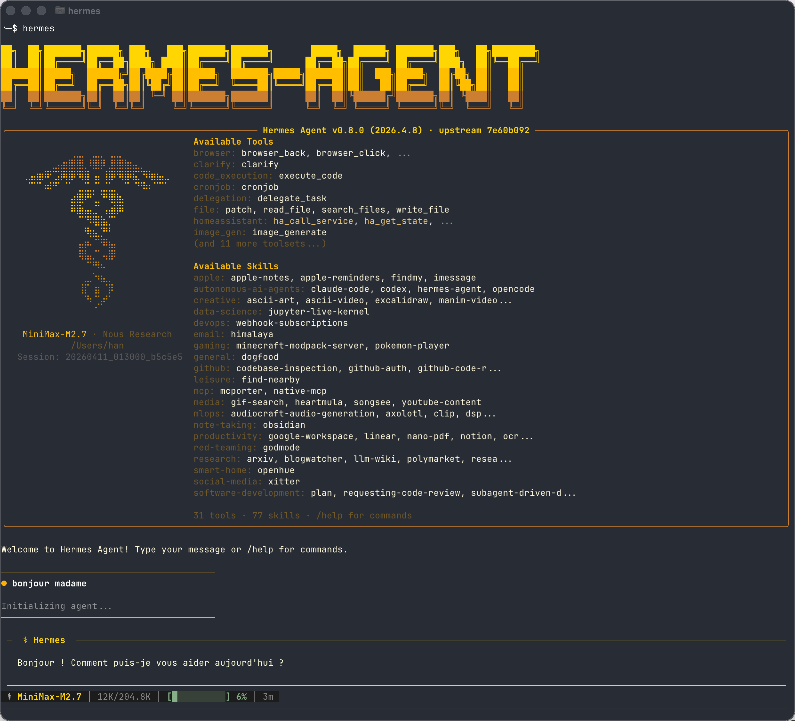

# 你好，Hermes Agent ☤

这是一个用于探索和分析 [Hermes Agent](https://github.com/nousresearch/hermes-agent) `v0.8.0 (v2026.4.8)` `86960cdb` 的工作区。

> ## 正确发音
> 
> 注意：本项目中的 “Hermes” 指的是希腊神话中的神。
> 
> ✔️ **Hermes**: `/ˈhɜːrmiːz/` — 希腊神话中的语言、文字之神，众神的使者（赫尔墨斯）。
> 
> ✖️ **Hermès**: `/ɛʁ.mɛs/` — 法国奢侈品牌（爱马仕）。

## 源代码分析

```sh
git clone https://github.com/nousresearch/hermes-agent
```

- [hermes-agent v2026.4.8 源代码分析](./源代码分析_v2026.4.8.md)

## 快速开始

```bash
# 运行设置向导
hermes setup

# 查看/编辑配置
code ~/.hermes/

# 开启交互式对话
hermes
```

----

## 相关资源

- **官方仓库**: https://github.com/nousresearch/hermes-agent
- **官方网站**: https://hermes-agent.nousresearch.com
- **快速入门文档**: https://hermes-agent.nousresearch.com/docs/getting-started/quickstart


