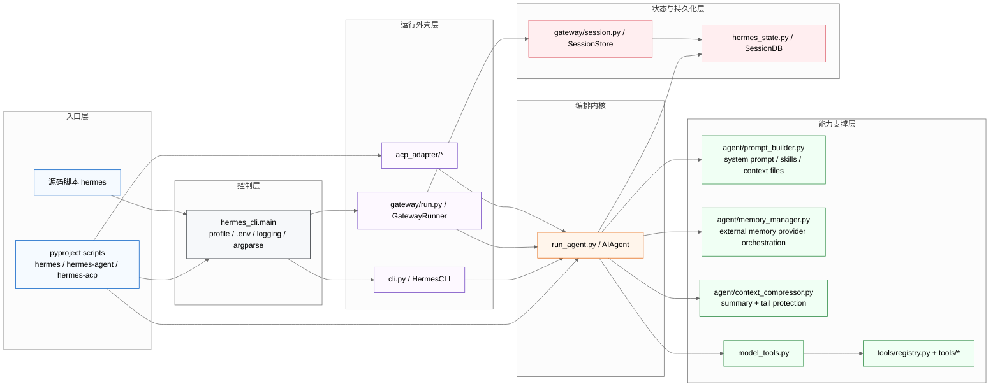
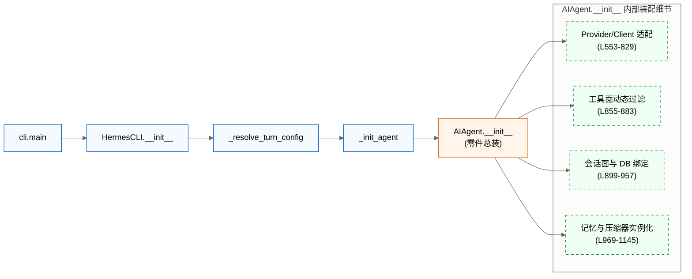
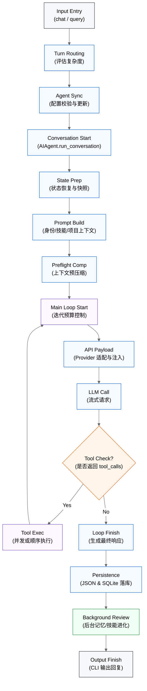
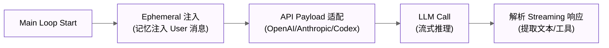
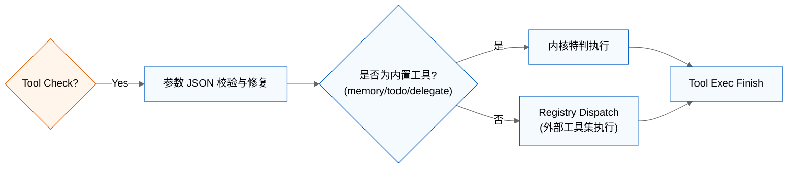
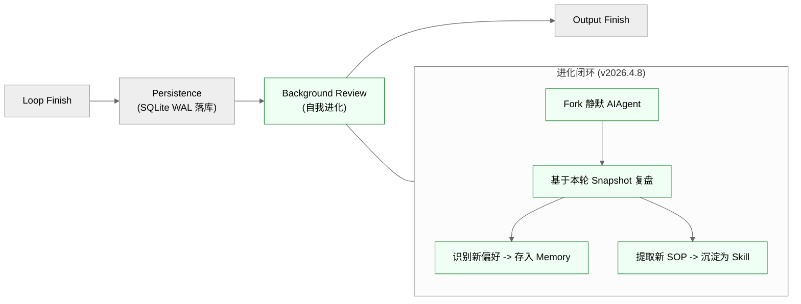

# Hermes Agent 源代码分析

基于当前工作区中的源码子仓库 `hermes-agent/` 进行分析。本次实际对应的是 `detached HEAD at v2026.4.8`，提交为 `86960cdb`，不是 `main` 分支上的浮动状态。

---

## 1. 系统架构总览

### 1.1 入口矩阵与运行面

Hermes Agent 在打包层暴露了三个正式入口，它们分别对应三种运行外壳：

| 入口 | 代码位置 | 作用 |
| --- | --- | --- |
| `hermes` | `hermes-agent/pyproject.toml:99-102` | 统一 CLI 入口，最终落到 `hermes_cli.main:main` |
| `hermes-agent` | `hermes-agent/pyproject.toml:99-102` | 直接运行 agent内核，落到 `run_agent:main` |
| `hermes-acp` | `hermes-agent/pyproject.toml:99-102` | ACP 适配入口，落到 `acp_adapter.entry:main` |
| 源码包装脚本 `hermes` | `hermes-agent/hermes:1-10` | 开发态包装器，本质上仍然转发到 `hermes_cli.main.main()` |

从源码职责看，Hermes 并不是“一个 CLI 程序”，而是一套共享内核加多个外壳：

1. `hermes_cli/main.py` 是统一控制平面，负责 profile、环境变量、日志和子命令分发，见 `hermes-agent/hermes_cli/main.py:83-137`、`hermes-agent/hermes_cli/main.py:4127-5577`。
2. `cli.py` 是终端交互壳，负责会话、展示、交互、打断、单次请求和 REPL，见 `hermes-agent/cli.py:1315-1579`、`hermes-agent/cli.py:6424-6854`、`hermes-agent/cli.py:7064-8518`、`hermes-agent/cli.py:8525-8733`。
3. `gateway/run.py` 是消息网关壳，负责多平台 adapter、消息接入、会话映射、投递和后台运行，见 `hermes-agent/gateway/run.py:461-566`。
4. `run_agent.py:AIAgent` 是真正的编排内核，CLI 和 Gateway 最终都收敛到这里，见 `hermes-agent/run_agent.py:433-1225`、`hermes-agent/run_agent.py:6800-9199`。

### 1.2 模块分层与职责

如果按“谁真正参与一次请求的完成”来切分，当前版本可以稳定抽象为六层：

| 层级 | 主要模块 | 核心职责 |
| --- | --- | --- |
| 入口层 | `pyproject.toml`、`hermes` | 暴露命令、选择运行面 |
| 控制层 | `hermes_cli/main.py` | 处理 profile、`.env`、日志、命令分发 |
| 外壳层 | `cli.py`、`gateway/run.py` | 装配终端或平台运行时，把输入整理成统一会话 |
| 编排层 | `run_agent.py:AIAgent` | 构建提示词、循环调用模型、执行工具、压缩上下文、持久化结果 |
| 能力层 | `model_tools.py`、`tools/*`、`agent/prompt_builder.py`、`agent/memory_manager.py`、`agent/context_compressor.py` | 提供工具、记忆、技能、上下文、压缩、路由等能力 |
| 持久化层 | `hermes_state.py`、`gateway/session.py` | 维护 SQLite、JSONL transcript、sessions 索引和 lineage |

### 1.3 系统架构图

---

## 2. 只看 CLI 到 AI Agent 的启动与请求流程

### 2.1 启动链：从 Shell 入口到内核零件装配

CLI 启动链不仅是脚本的跳转，更是 AIAgent 运行时“零件”的完整装配过程。

#### 启动阶段的关键装配逻辑：
1.  **零件总装 (AIAgent.__init__)**：它不是简单的 OpenAI client 封装，而是将本次会话所需的全部零件装配成一个有状态的编排器。具体执行 L433-1225 的逻辑。
2.  **运行时 Provider 适配**：根据 `provider`、`api_mode` 和凭据池决定使用 Chat Completions 还是 Anthropic Messages，见 `run_agent.py:553-854`。
3.  **工具面动态过滤**：通过 `get_tool_definitions()` 解析 toolset，并根据 `check_fn` 自动剔除当前环境不可用的工具，见 `model_tools.py:234-353`。
4.  **会话面与 DB 绑定**：为 session 生成日志文件、绑定 `SessionDB`、创建 session row，并记录 `_last_flushed_db_idx` 避免重复写库，见 `run_agent.py:899-957`。
5.  **记忆与压缩器挂载**：加载 `MEMORY.md`，并通过 `MemoryManager` 统一接管外部存储；同时根据 context_length 实例化 `ContextCompressor`，见 `run_agent.py:969-1145`。

#### 启动链代码对照表 (v2026.4.8)：

| 步骤 | 文件 | 类/方法 | 行号 |
| --- | --- | --- | --- |
| **入口转发** | `hermes` | 脚本 Launcher | `1-10` |
| **统一入口** | `hermes_cli/main.py` | `_apply_profile_override()` | `83-137` |
| **命令注册** | `hermes_cli/main.py` | `main()` | `4127-5577` |
| **Chat 分发** | `hermes_cli/main.py` | `cmd_chat()` | `556-663` |
| **CLI 壳创建** | `cli.py` | `main()` | `8525-8733` |
| **CLI 会话装配**| `cli.py` | `HermesCLI.__init__()` | `1315-1579` |
| **Agent 初始化**| `cli.py` | `_init_agent()` | `2363-2478` |
| **内核装配** | `run_agent.py` | `AIAgent.__init__()` | `433-1224` |

---

### 2.2 请求链：一条输入演变为编排循环与进化的全过程

用户的一条消息输入会触发一个复杂的多阶段流水线，包含动态路由、预处理、多轮编排和后台复盘。

#### 请求链完整代码对照表 (v2026.4.8)：

| 节点 (Node) | 文件 | 类/方法 | 行号 |
| --- | --- | --- | --- |
| **Input Entry** | `cli.py` | `HermesCLI.chat` / `main` | `6424` / `8525` |
| **Turn Routing** | `cli.py` | `_resolve_turn_agent_config` | `2344` |
| **Agent Sync** | `cli.py" | `_init_agent` (调用点) | `6451-6463` |
| **Conv Start** | `run_agent.py" | `AIAgent.run_conversation` | `6800` |
| **State Prep** | `run_agent.py" | `run_conversation` (逻辑段) | `6832-6937` |
| **Prompt Build** | `run_agent.py" | `_build_system_prompt` | `2582` |
| **Preflight Comp** | `run_agent.py" | `_compress_context` (调用点) | `6993` |
| **Loop Start** | `run_agent.py" | `run_conversation` (While 循环) | `7111` |
| **API Payload** | `run_agent.py" | `_build_api_kwargs` | `5229` |
| **LLM Call** | `run_agent.py" | `run_conversation` (API 调用段) | `7529` |
| **Tool Check?** | `run_agent.py" | `run_conversation` (分支判定) | `8721` |
| **Tool Exec** | `run_agent.py" | `_execute_tool_calls` | `5930` |
| **Loop Finish** | `run_agent.py" | `run_conversation" (收尾逻辑) | `9008` |
| **Persistence** | `run_agent.py" | `_persist_session` | `1842` |
| **Background Review**| `run_agent.py" | `_spawn_background_review` | `1718` |
| **Output Finish** | `cli.py" | `chat` (渲染段) | `6610` |

---

## 3. 编排内核请求生命周期深度解析

本节深入分析 `AIAgent.run_conversation()` 内部的执行细节，展示一条指令如何从状态恢复演变为自我进化的闭环。

#### 3.1 编排准备：状态快照与环境对齐 (Node 4-5)

在正式进入模型循环前，Agent 必须确保运行时环境的纯净与一致。

-   **运行时对齐**：`run_conversation` 首先确保切回主模型 Provider，并重置所有重试计数器，见 `run_agent.py:6832-6863`。
-   **状态隔离**：通过克隆 `conversation_history` 确保本轮请求的尝试不会意外污染长期的会话上下文，除非请求成功完成，见 `run_agent.py:6892-6907`。

#### 3.2 动态提示词构建与上下文预压缩 (Node 6-7)

Hermes 追求提示词的**高稳定性**以最大化利用 Provider 的 **Prompt Cache**。

-   **提示词冻结 [核心机制]**：系统提示词一旦构建便会被缓存。只有发生压缩或首次启动时才会重新生成，见 `run_agent.py:2582-2741`。其逻辑顺序包括身份层 (L2599)、工具行为约束 (L2611)、记忆层 (L2665)、技能索引 (L2685) 和项目上下文 (L944)。
-   **结构化压缩 (Preflight)**：在请求前校验 Token 长度。若超标，`ContextCompressor` 会保留 Head 和 Tail，将中间部分总结为带 `Goal/Decisions/Next Steps` 的摘要，见 `agent/context_compressor.py:565-690`。

#### 3.3 主编排循环与模型适配 (Node 8-10)

这是 Agent 的“思考”核心，负责处理模型迭代与 Provider 差异。

-   **Ephemeral 注入 [核心机制]**：为了不破坏 System Prompt 的缓存，外部记忆等易变上下文会被包在 `<memory-context>` 中注入到**当前轮次的 User Message**，见 `run_agent.py:7168-7185`。
-   **Payload 适配器 [核心机制]**：`_build_api_kwargs` 负责将内部消息结构映射为不同 Provider 的专用 Payload（如 Anthropic 的消息列表或 Codex 的并行工具调用参数），见 `run_agent.py:5229-5450`。

#### 3.4 工具执行子系统 (Node 11-12)

Hermes 采用动态过滤与静态注册相结合的工具体系。

-   **并发执行策略**：`_execute_tool_calls` 会根据工具批次决定是使用线程池并发执行（如独立的文件读取），还是顺序执行（如具有依赖关系的 shell 操作），见 `run_agent.py:5930-6136`。
-   **动态可见性**：模型只能看到当前 `toolset` 允许且 `check_fn` 校验通过的工具，其发现逻辑定义在 `model_tools.py:132-185`。

#### 3.5 请求收尾、持久化与后台进化 (Node 13-16)

这是 Hermes 区别于普通 Agent 的关键：完成任务只是自我提升的开始。

-   **多层持久化 [核心机制]**：SQLite `SessionDB` 采用 **WAL 模式** 确保多进程读写安全；同时记录 JSON transcript 用于终端回溯，见 `hermes_state.py:857-930`。
-   **后台复盘机制 [核心机制]**：`_spawn_background_review` 会启动一个不干扰用户的独立 Agent 实例，将本次成功的实践沉淀为长期记忆（MEMORY.md）或可复用的 Skill（skills/ 目录），见 `run_agent.py:1718-1822`。

---

## 4. 结论

Hermes Agent `v2026.4.8` 的核心设计哲学可以总结为：**外壳负责交互与路由，AIAgent 负责编排与进化**。它不仅仅是在执行工具，而是在运行一个完整的“感知-思考-执行-反思”闭环。通过 **Prompt Cache 优化** 降低成本，通过 **Turn 级路由** 提升灵活性，并最终通过 **后台复盘** 实现系统的持续自我进化。只要抓住 **`入口 -> 外壳 -> AIAgent -> prompt/memory/tool/session`** 这条主链，即可透彻理解其源码精髓。
