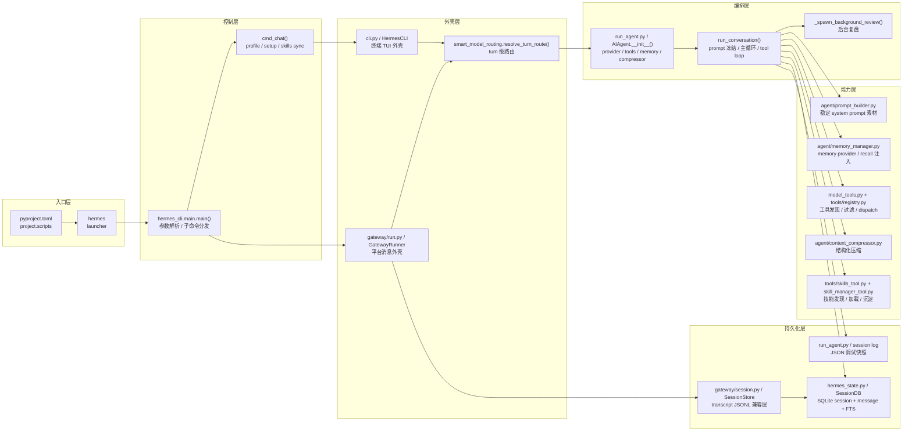
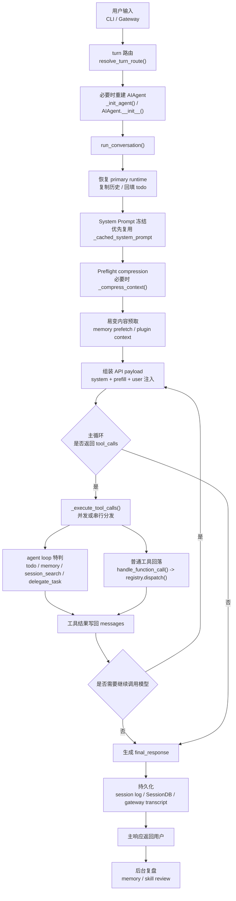

# 深度剖析 Hermes Agent：构建一个能“自我进化”的 AI 编排内核

在 AI Agent 领域，我们见过了太多简单的 LLM Wrapper。它们大多只是把用户输入塞进模板，调用一次 API，然后等待结果。但在深入研究了 **Hermes Agent v2026.4.8** 的源代码后，我发现它提供了一个完全不同的工程范式。

Hermes 不仅仅是一个工具调用器，它是一个具备**持久化记忆**、**动态上下文压缩**以及**自动化经验沉淀**能力的闭环系统。今天，我们直接从源码出发，拆解它的核心架构与运行机制。

> 对照方式：本文把关键判断绑定到 `v2026.4.8/` 目录中的源码副本，并在源码里加入统一的 `【文档锚点 ...】` 注释。阅读时可以直接全文搜索同一个锚点，实现“文档段落 ↔ 源码代码块 ↔ 关键落点行”的三向对照。

| 锚点 | 用途 |
| --- | --- |
| `1A`-`1C` | 入口、控制层、CLI / Gateway 外壳 |
| `2A`-`2E` | 延迟初始化与 turn 级动态路由 |
| `3A`-`3D` | Prompt 冻结、易变注入、主循环、工具分发 |
| `4A`-`4C` | 压缩、SQLite 持久化、Gateway transcript JSONL |
| `5A`-`5B` | 后台复盘、Skill 运行时与沉淀入口 |

---

## 0. 按流程读代码

如果你想按主线把代码顺下来，不建议在仓库里跳着读。直接按下面这 **12 步** 打开文件，基本就能把 `CLI -> AIAgent -> tool loop -> persistence -> review` 走通。

> 推荐顺序：先读第 `1-4` 步看“怎么进内核”，再读第 `5-12` 步看“一次 turn 怎么跑完”。

| 步骤 | 阶段 | 文件 | 方法 / 入口 | 你要看什么 |
| --- | --- | --- | --- | --- |
| `1` | 命令入口 | `hermes` | launcher | `hermes` 命令如何转发到 Python 入口 |
| `2` | 管理平面入口 | `hermes_cli/main.py` | `main()` | 参数解析、子命令分发、默认进入 `chat` |
| `3` | Chat 分发 | `hermes_cli/main.py` | `cmd_chat()` | setup / skills sync 后如何移交给 `cli.main()` |
| `4` | CLI 外壳装配 | `cli.py` | `HermesCLI.__init__()` / `_resolve_turn_agent_config()` / `_init_agent()` | 延迟初始化、turn 路由、何时创建 `AIAgent` |
| `5` | 内核总装 | `run_agent.py` | `AIAgent.__init__()` | provider、tools、memory、compressor、session 状态如何一次装好 |
| `6` | turn 入口 | `run_agent.py` | `run_conversation()` | 一次请求从哪里真正进入 agent 主流程 |
| `7` | 稳定上下文 | `run_agent.py` / `agent/prompt_builder.py` | `_build_system_prompt()` / `build_skills_system_prompt()` / `build_context_files_prompt()` | system prompt 为什么能缓存、稳定内容有哪些 |
| `8` | 请求前预算治理 | `run_agent.py` / `agent/context_compressor.py` | `_compress_context()` / `ContextCompressor.compress()` | preflight compression、handoff 摘要、session lineage |
| `9` | 易变内容注入 | `run_agent.py` / `agent/memory_manager.py` | `prefetch_all()` / `build_memory_context_block()` | memory recall、plugin context、prefill/system 注入为什么不写回 transcript |
| `10` | 工具回路 | `run_agent.py` | `_execute_tool_calls()` | `tool_calls` 后怎样进入并发 / 顺序执行 |
| `11` | 工具分发 | `model_tools.py` / `tools/registry.py` / `tools/skills_tool.py` / `tools/skill_manager_tool.py` | `handle_function_call()` / `dispatch()` / `skills_list()` / `skill_view()` / `skill_manage()` | agent loop 特判与普通工具回落、技能读取与技能沉淀 |
| `12` | 落盘与复盘 | `run_agent.py` / `hermes_state.py` / `gateway/session.py` | `_save_session_log()` / `append_message()` / `append_to_transcript()` / `_spawn_background_review()` | JSON session log、SQLite、gateway transcript、后台 review |

如果你要看 `Gateway` 主线，把第 `2-4` 步替换为：

| 步骤 | 文件 | 方法 / 入口 | 你要看什么 |
| --- | --- | --- | --- |
| `2G` | `gateway/run.py` | `start_gateway()` | 网关启动、日志、skills sync、Runner 生命周期 |
| `3G` | `gateway/run.py` | `GatewayRunner.__init__()` | 平台适配器、session store、agent cache |
| `4G` | `gateway/run.py` | `_resolve_turn_agent_config()` | Gateway 如何复用同一套 turn 路由逻辑 |

---

## 1. 核心架构：从外壳到内核的六层解耦



Hermes 的设计非常清爽，它并没有把逻辑堆死在某个 CLI 文件里，而是采用了一套严谨的分层结构：

1.  **入口层 (`pyproject.toml`)**：通过统一的脚本分发，决定运行面（CLI、Agent 内核或 ACP 适配器）。
2.  **控制层 (`hermes_cli/main.py`)**：这是系统的“管理平面”，负责 Profile 切换、环境变量加载和子命令分发。
3.  **外壳层 (`cli.py` / `gateway/run.py`)**：负责将不同平台（终端 TUI 或消息网关）的输入标准化为统一会话。
4.  **编排层 (`run_agent.py:AIAgent`)**：**系统的灵魂**。负责构建 Prompt、管理模型循环、执行工具并处理上下文压缩。
5.  **能力层 (`agent/` / `tools/`)**：包含工具集、记忆管理器和上下文压缩算法。
6.  **持久化层 (`hermes_state.py` / `gateway/session.py`)**：基于 SQLite (FTS5) 与 gateway transcript JSONL，确保每一轮决策都有迹可循。

| 层级 | 主要模块 | 职责 |
| --- | --- | --- |
| 入口层 | `pyproject.toml`、`hermes` | 暴露命令、选择运行面 |
| 控制层 | `hermes_cli/main.py` | 读取配置、建立运行环境、分发子命令 |
| 外壳层 | `cli.py`、`gateway/run.py` | 把终端或平台输入整理成统一会话 |
| 编排层 | `run_agent.py:AIAgent` | 构建 prompt、循环调用模型、执行工具、压缩上下文、持久化结果 |
| 能力层 | `model_tools.py`、`agent/prompt_builder.py`、`agent/memory_manager.py`、`agent/context_compressor.py`、`tools/*` | 工具、技能、记忆、上下文注入与压缩 |
| 持久化层 | `hermes_state.py`、`gateway/session.py` | SQLite、JSON session log、gateway transcript、session lineage |

---

## 2. 启动链路：延迟加载与动态路由

这一节主要对应总导航里的 **第 `1-5` 步**。

在 `v2026.4.8` 中，一个关键的工程细节是：**`AIAgent` 并不是在进程启动时创建的**。

系统会等到真正需要跑一个 Turn（对话回合）时，才执行 `_init_agent()` 进行总装。这种设计的精妙之处在于它支持 **Turn 级的动态路由**（见源码中的 `【文档锚点 2A】`、`【文档锚点 2B】`、`【文档锚点 2C】`）。系统会根据当前消息的复杂度，实时判断是走“廉价路径”（Cheap Route）还是“主路径”（Primary Route）。如果路由策略发生变化，系统会果断重装内核实例，确保每一份算力都用在刀刃上。

完整调用链可以先按下面这条路径把握，再逐段去搜源码锚点：

```text
hermes
  -> hermes_cli.main:main()
    -> cmd_chat()
      -> cli.main()
        -> HermesCLI.__init__()
          -> 首次 turn 时 _init_agent()
            -> AIAgent(...)
```

---

## 3. 硬核拆解：单次请求（Turn）的生命周期

这一节主要对应总导航里的 **第 `6-12` 步**。

这是内核最复杂的齿轮组。一次用户输入到响应，经历的是一个高度受控的编排流程：



### 3.1 第一步：用户输入先经过 turn 路由

图中的 `A -> B -> C` 对应的不是单纯“把消息传给模型”，而是一次带策略判断的入口整理：

1. 用户输入可能来自 `CLI`，也可能来自 `Gateway` 外壳。
2. 外壳在真正进入 agent 前，都会先调用 `resolve_turn_route()` 判断当前消息是否要走 cheap route 还是 primary route（见 `【文档锚点 2B】`）。
3. 如果 route signature 变化，现有 `AIAgent` 会被丢弃，并重新 `_init_agent()`。
4. 因此，图里的 `必要时重建 AIAgent` 不是异常分支，而是 Hermes 的常规设计之一：**模型选择发生在 turn 级，而不是进程级。**

### 3.2 第二步：进入 `run_conversation()` 之前，先恢复运行时并整理历史

图中的 `D -> E` 表示 `AIAgent` 并不会拿着原始输入立刻发请求，而是先把本轮运行时恢复到一个干净、可继续的状态：

1. 恢复 primary runtime，清理 fallback 残留，确保上一轮 provider 降级不会污染本轮（见 `【文档锚点 3C】` 之前的准备段）。
2. 复制历史消息，剥离预算警告，并在需要时从历史中回填 todo store。
3. 把当前用户消息追加进 `messages`，形成当前 turn 的基线消息列表。

这一段的意义是：**Hermes 的主循环不是从“当前输入”开始，而是从“恢复后的会话状态”开始。**

### 3.3 第三步：冻结稳定上下文，再决定是否预压缩

图中的 `E -> F -> G` 其实包含了两个很关键的工程边界。

先看 `System Prompt 冻结`：

1. `run_conversation()` 会优先复用 `_cached_system_prompt`，如果会话已经持久化过，则尽量直接读取已有 system prompt，而不是每轮重建。
2. 只有首次进入会话，或压缩后需要重建时，才会重新执行 `_build_system_prompt()`。
3. `_build_system_prompt()` 组装的都是稳定内容：身份、工具约束、技能索引、项目上下文、memory provider 的 system block 等（见 `【文档锚点 3A】`）。

再看 `Preflight compression`：

1. 在真正发请求前，Hermes 会先粗估当前 `messages + system prompt + tools` 的 token 体积。
2. 如果此时已经逼近压缩阈值，就直接在主循环之前执行 `_compress_context()`，而不是等到模型报错后再补救。
3. 这解释了图里的 `Preflight compression` 为什么位于主循环之前：**压缩是一次请求前的预算治理动作，不只是异常恢复。**

### 3.4 第四步：把易变内容注入 API payload，而不是写进持久历史

图中的 `H -> I` 是 Hermes 最容易被忽略、但最有辨识度的一步。

为了最大化 Prompt Cache 的命中率，Hermes 将上下文拆成两类：

1. **稳定上下文**：进入 `_cached_system_prompt`，尽可能跨 turn 复用，见 `【文档锚点 3A】`。
2. **易变上下文**：只在本次 API payload 注入，见 `【文档锚点 3B】`。

这一层具体又分三步：

1. 记忆管理器先 `prefetch_all()`，把 recall 结果缓存到本轮局部变量。
2. recall 结果会被包装成 `<memory-context>` 块，追加到**当前 turn 的 user message**，而不是写回系统提示词。
3. `ephemeral_system_prompt`、`prefill_messages`、plugin 注入上下文也都只发生在 API payload 组装阶段，不直接落入持久 transcript。

所以图中的 `组装 API payload` 不是简单序列化消息，而是 Hermes 对“稳定内容”和“易变内容”做完边界切分后的最终合成。

### 3.5 第五步：主循环负责把模型回复扩展成完整 tool loop

图中的 `J -> K -> L/M -> N -> O` 是整条请求链最核心的控制回路。

1. `run_conversation()` 进入 `while api_call_count < self.max_iterations` 主循环，向模型发请求。
2. 如果模型没有返回 `tool_calls`，就直接收敛到 `final_response`。
3. 如果模型返回了 `tool_calls`，则先进入 `_execute_tool_calls()`，由它决定并发还是顺序执行，见 `【文档锚点 3D】`。
4. 在工具层内部又会继续分叉：
   `todo`、`memory`、`session_search`、`delegate_task` 这类工具由 agent loop 特判处理。
   其他普通工具回落到 `handle_function_call()`，再经 `registry.dispatch()` 分发到真实 handler。
5. 工具结果会被重新写回 `messages`，随后再次判断是否需要继续调用模型。

因此，图里的回环 `N -> O -> I` 表达的是 Hermes 的真实抽象：**一次用户 turn 不是一次模型调用，而是“模型输出 + 工具执行 + 结果回写 + 再次调用模型”的循环编排。**

补充一点：技能沉淀相关工具也分成两层。
`skill_manage` 是“写技能”的沉淀入口，而 `skills_list` / `skill_view` 是“发现和加载技能”的运行时入口，见 `【文档锚点 5B】`。

### 3.6 第六步：生成最终响应后，还要完成持久化和后台复盘

图里的 `P -> Q -> R -> S` 表明 Hermes 把“回答用户之后的收尾工作”也纳入了 turn 生命周期。

先是持久化：

1. agent 侧会保存 JSON session log，保留完整消息快照，见 `【文档锚点 4B】`。
2. 结构化消息会进入 `SessionDB`，用于后续检索、resume 和 lineage 管理，见 `【文档锚点 4B】`。
3. gateway 模式下还会同步维护 transcript JSONL 兼容层，见 `【文档锚点 4C】`。

然后才是返回用户：

1. `final_response` 交付给用户，当前主任务在交互层面结束。
2. 但内核不会立刻停止，而是根据 memory / skill nudge 条件决定是否启动 `_spawn_background_review()`。
3. 后台复盘会 fork 一个安静的 agent，回看本轮 `messages_snapshot`，决定是否要写 memory、更新 skill，或为下一轮做 recall 预热，见 `【文档锚点 5A】`。

这一步解释了图中最后一个节点 `后台复盘` 的位置：它不是独立功能，而是主请求生命周期的尾声。

---

## 4. 上下文压缩：结构化“交接棒”

当对话接近 Token 上限时，Hermes 的 `ContextCompressor` 并非简单裁掉历史，而是一次“交接”（见源码中的 `【文档锚点 4A】`）：
1.  **保留头部**（任务目标）和**尾部**（最新进展）。
2.  **摘要化中间段**：生成包含“已达成目标”、“关键决策”、“待办事项”的结构化摘要。
3.  **Lineage 持久化**：在 SQLite 层生成一个新的 Lineage Session，确保会话的血缘关系不丢失；而 gateway 侧 transcript 仍通过 JSONL 兼容层保留读写路径（见源码中的 `【文档锚点 4B】` 与 `【文档锚点 4C】`）。

---

## 5. 自我进化：异步复盘机制

Hermes 的“自我进化”主要由**后台 Review** 驱动：
*   **主任务完成后的触发**：当 `final_response` 交付给用户后，内核会异步启动 `_spawn_background_review()`（见源码中的 `【文档锚点 5A】`）。
*   **经验沉淀**：它会 Fork 一个安静的内核实例回看刚才的对话。如果发现用户的新偏好，写入 Memory；如果解决了复杂问题，调用 `skill_manage` 沉淀成新 Skill，而 Skill 的发现与加载则由 `skills_list` / `skill_view` 提供运行时入口（见源码中的 `【文档锚点 5A】` 与 `【文档锚点 5B】`）。

补充一个容易忽略的点：`gateway/run.py` 不是另一套内核，而是另一层外壳。它的价值在于复用同一个 `AIAgent` 编排内核，同时通过 `GatewayRunner` 缓存 agent 实例、复用 prompt cache，并把平台消息接入统一 session 流程。

---

## 6. 结语

通过源码可以看到，Hermes Agent 的核心竞争力不在于它调用了哪个强大的模型，而在于它如何**微观治理每一个请求 Turn**。从动态路由到动静分离的 Prompt 构建，再到异步的自我复盘，这种对工程细节的极致追求，才是 AI 智能体走向成熟的必经之路。

如果只保留一句话来描述 `v2026.4.8` 的主链：

> 外壳负责接入、路由和交互；`AIAgent` 负责把一次用户输入扩展成一个带 prompt 冻结、动态上下文注入、工具循环、上下文压缩、持久化和后台复盘的完整 turn。

## 附录：源码入口速查

| 文件 | 关键类/方法 | 作用 |
| --- | --- | --- |
| `hermes_cli/main.py` | `main()` / `cmd_chat()` | CLI 参数解析与 chat 分发 |
| `cli.py` | `HermesCLI.__init__()` / `_resolve_turn_agent_config()` / `_init_agent()` / `chat()` / `main()` | 终端外壳、turn 路由、延迟初始化 |
| `run_agent.py` | `AIAgent.__init__()` / `_build_system_prompt()` / `run_conversation()` / `_execute_tool_calls()` / `_compress_context()` / `_spawn_background_review()` | 编排内核主链 |
| `model_tools.py` | `_discover_tools()` / `get_tool_definitions()` / `handle_function_call()` | 工具发现、过滤与分发 |
| `tools/registry.py` | `ToolRegistry.register()` / `dispatch()` | 工具注册中心 |
| `agent/prompt_builder.py` | `build_skills_system_prompt()` / `build_context_files_prompt()` | 稳定 prompt 素材构造 |
| `agent/memory_manager.py` | `MemoryManager` / `build_memory_context_block()` | 记忆提供者编排与 recall 注入 |
| `agent/context_compressor.py` | `ContextCompressor.compress()` | 结构化压缩与 handoff 摘要 |
| `agent/smart_model_routing.py` | `resolve_turn_route()` | turn 级模型路由 |
| `hermes_state.py` | `SessionDB` / `append_message()` | SQLite 会话持久化 |
| `gateway/session.py` | `SessionStore` / `append_to_transcript()` / `load_transcript()` | gateway transcript JSONL 兼容层 |
| `gateway/run.py` | `GatewayRunner` / `start_gateway()` | 平台外壳与网关启动入口 |
| `tools/skills_tool.py` | `skills_list()` / `skill_view()` | 技能发现与技能内容加载 |
| `tools/skill_manager_tool.py` | `skill_manage()` | 技能沉淀与维护 |

---
*本文基于 hermes-agent v2026.4.8 (Commit 86960cdb) 源码分析。*
